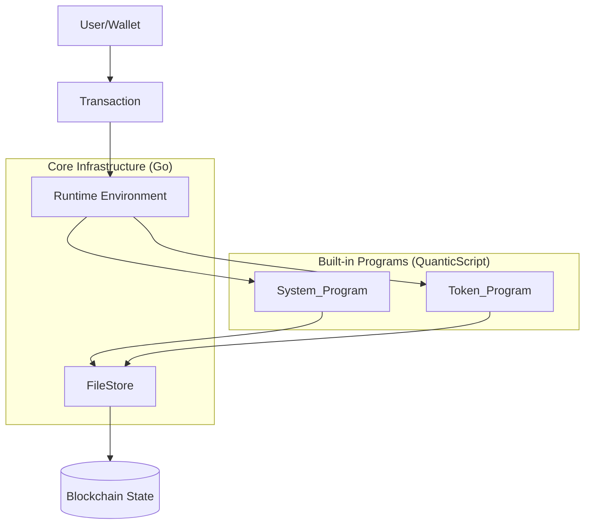

# Design Document

## Overview

This document outlines the technical design for implementing the System_Program and Token_Program as built-in blockchain programs written in QuanticScript. These programs will be compiled to bytecode and deployed at genesis, providing core functionality for managing Neon (the native coin) and custom tokens on the blockchain.

The design leverages the existing file-based state model where all blockchain state is stored as files with the following structure:
- `ID`: 32-byte unique identifier
- `Balance`: Neon balance (int64)
- `TxManager`: Program that manages this file
- `Data`: Arbitrary byte array for program-specific data
- `Executable`: Boolean flag indicating if the file contains executable bytecode

## Architecture

### System Architecture



### Program Execution Flow

1. Transaction submitted with instruction data
2. Runtime loads program bytecode from FileStore
3. BytecodeInterpreter executes QuanticScript instructions
4. Program uses opcodes to read/modify file state
5. Changes validated and committed to FileStore

## Components and Interfaces

### 1. System_Program (QuanticScript)

The System_Program manages Neon accounts and basic operations.

**File Structure:**
- Stored as an executable file at genesis
- FileID: `0x00...01` (32 bytes, last byte = 0x01)
- TxManager: Points to Runtime program
- Data: Contains compiled QuanticScript bytecode
- Executable: true

**Instruction Set:**


```
Instruction 0: CreateAccount
  Input: [owner_pubkey: PublicKey, initial_balance: i64]
  Output: [account_id: FileID]
  
Instruction 1: Transfer
  Input: [from: FileID, to: FileID, amount: i64]
  Output: []
  
Instruction 2: AllocateSpace
  Input: [account: FileID, additional_balance: i64]
  Output: []
```

**Key Operations:**
- Create user accounts with empty data field
- Transfer Neon between accounts by modifying balance fields
- Validate balance constraints (non-negative)
- Enforce storage rent model

### 2. Token_Program (QuanticScript)

The Token_Program manages custom fungible tokens.

**File Structure:**
- Stored as an executable file at genesis
- FileID: `0x00...02` (32 bytes, last byte = 0x02)
- TxManager: Points to Runtime program
- Data: Contains compiled QuanticScript bytecode
- Executable: true

**Instruction Set:**

```
Instruction 0: InitializeMint
  Input: [decimals: u8, mint_authority: PublicKey, freeze_authority: PublicKey|null]
  Output: [mint_id: FileID]
  
Instruction 1: InitializeAccount
  Input: [mint: FileID, owner: FileID]
  Output: [account_id: FileID]
  
Instruction 2: Transfer
  Input: [source: FileID, destination: FileID, amount: u64]
  Output: []
  
Instruction 3: MintTo
  Input: [mint: FileID, destination: FileID, amount: u64]
  Output: []
  
Instruction 4: Burn
  Input: [account: FileID, amount: u64]
  Output: []
  
Instruction 5: CloseAccount
  Input: [account: FileID, destination: FileID]
  Output: []
  
Instruction 6: FreezeAccount
  Input: [account: FileID]
  Output: []
  
Instruction 7: ThawAccount
  Input: [account: FileID]
  Output: []
  
Instruction 8: Approve
  Input: [account: FileID, delegate: PublicKey, amount: u64]
  Output: []
  
Instruction 9: Revoke
  Input: [account: FileID]
  Output: []
  
Instruction 10: CreateAssociatedTokenAccount
  Input: [owner: FileID, mint: FileID]
  Output: [account_id: FileID]
```

### 3. Data Models

#### Mint Account Data Structure

```
struct MintAccount {
  supply: u64,           // Total token supply (8 bytes)
  decimals: u8,          // Number of decimal places (1 byte)
  mint_authority: [u8; 32] | null,  // Mint authority pubkey (32 bytes or 1 byte for null)
  freeze_authority: [u8; 32] | null, // Freeze authority pubkey (32 bytes or 1 byte for null)
}
// Total size: 74 bytes (with authorities) or 10 bytes (without)
```

Stored in File.Data field, serialized as:
- Bytes 0-7: supply (little-endian u64)
- Byte 8: decimals
- Byte 9: mint_authority flag (0=null, 1=present)
- Bytes 10-41: mint_authority pubkey (if present)
- Byte 42: freeze_authority flag (0=null, 1=present)
- Bytes 43-74: freeze_authority pubkey (if present)

#### Token Account Data Structure

```
struct TokenAccount {
  mint: FileID,          // Reference to mint account (32 bytes)
  owner: FileID,         // Reference to owner account (32 bytes)
  token_balance: u64,    // Token amount (8 bytes)
  delegate: [u8; 32] | null,  // Delegate pubkey (32 bytes or 1 byte for null)
  delegated_amount: u64, // Amount delegated (8 bytes)
  frozen: bool,          // Freeze status (1 byte)
}
// Total size: 114 bytes (with delegate) or 82 bytes (without)
```

Stored in File.Data field, serialized as:
- Bytes 0-31: mint FileID
- Bytes 32-63: owner FileID
- Bytes 64-71: token_balance (little-endian u64)
- Byte 72: delegate flag (0=null, 1=present)
- Bytes 73-104: delegate pubkey (if present)
- Bytes 105-112: delegated_amount (little-endian u64)
- Byte 113: frozen (0=false, 1=true)

### 4. Storage Rent Model

The existing FileStore implements exponential storage cost:

```
cost = base_cost_per_kb * size_in_kb * (1.1 ^ size_in_mb)
```

Where:
- `base_cost_per_kb = 1000` Neon units
- Size is rounded up to nearest KB

**Validation Points:**
1. File creation: `ValidateStorageCost(file)` checks balance >= required cost
2. Balance decrease: `UpdateFileBalance` validates new balance still covers data size
3. Data size increase: `UpdateFile` validates balance covers new data size

## Error Handling

### System_Program Errors

```
Error 0x1000: InsufficientBalance
Error 0x1001: InvalidAccount
Error 0x1002: BalanceOverflow
Error 0x1003: StorageRentViolation
Error 0x1004: UnauthorizedSigner
```

### Token_Program Errors

```
Error 0x2000: InsufficientTokenBalance
Error 0x2001: InvalidMint
Error 0x2002: InvalidTokenAccount
Error 0x2003: MintMismatch
Error 0x2004: UnauthorizedMintAuthority
Error 0x2005: UnauthorizedFreezeAuthority
Error 0x2006: UnauthorizedOwner
Error 0x2007: AccountFrozen
Error 0x2008: AccountNotEmpty
Error 0x2009: DelegateNotSet
Error 0x200A: InsufficientDelegatedAmount
Error 0x200B: FixedSupplyMint
```

### Error Handling Strategy

1. **Validation First**: All checks performed before state modifications
2. **Atomic Operations**: Use transaction context to rollback on error
3. **Clear Messages**: Error codes map to descriptive messages
4. **Propagation**: Errors bubble up through Runtime to transaction processor

## Testing Strategy

### Unit Testing (QuanticScript Programs)

**System_Program Tests:**
1. Account creation with valid balance
2. Account creation with insufficient balance (should fail)
3. Neon transfer between accounts
4. Transfer with insufficient balance (should fail)
5. Transfer resulting in negative balance (should fail)
6. Storage rent validation on balance decrease

**Token_Program Tests:**
1. Mint account initialization
2. Token account creation
3. Token transfers between accounts
4. Minting tokens with valid authority
5. Minting without authority (should fail)
6. Burning tokens
7. Closing empty accounts
8. Closing non-empty accounts (should fail)
9. Freezing and thawing accounts
10. Delegate approval and transfers
11. Associated token account derivation

### Integration Testing (Go + QuanticScript)

1. **Genesis Initialization**: Verify both programs loaded at genesis
2. **Cross-Program Calls**: Token program invoking system program for Neon transfers
3. **Storage Rent Enforcement**: Create large token accounts and verify rent requirements
4. **Transaction Processing**: End-to-end transaction execution through Runtime
5. **State Consistency**: Verify FileStore state matches expected after operations

### Bytecode Verification

1. Compile QuanticScript source to bytecode
2. Disassemble bytecode and verify instruction sequence
3. Execute bytecode in interpreter with test contexts
4. Verify compute budget consumption
5. Test determinism (same inputs = same outputs)

## Implementation Phases

### Phase 1: QuanticScript Language Extensions

Ensure QuanticScript supports all required features:
- Struct serialization/deserialization helpers
- FileID type and operations
- PublicKey type and operations
- Error handling primitives
- Instruction data parsing utilities

### Phase 2: System_Program Implementation

1. Write QuanticScript source for System_Program
2. Implement instruction handlers (CreateAccount, Transfer, AllocateSpace)
3. Add balance validation logic
4. Integrate storage rent checks
5. Compile to bytecode
6. Unit test with mock execution context

### Phase 3: Token_Program Implementation

1. Write QuanticScript source for Token_Program
2. Implement data structure serialization
3. Implement all 11 instruction handlers
4. Add authority validation
5. Add freeze/delegate logic
6. Compile to bytecode
7. Unit test with mock execution context

### Phase 4: Genesis Integration

1. Create genesis initialization code
2. Load System_Program bytecode at FileID 0x00...01
3. Load Token_Program bytecode at FileID 0x00...02
4. Set appropriate TxManager references
5. Allocate sufficient Neon balance for program storage
6. Verify programs executable at genesis

### Phase 5: Integration and Testing

1. Write integration tests
2. Test cross-program invocation
3. Verify storage rent enforcement
4. Performance testing and optimization
5. Security audit of program logic

## Security Considerations

### 1. Authority Validation

- All privileged operations MUST verify signer authority
- Use `OpHasSigner` to check transaction signers
- Validate owner/authority matches before state modifications

### 2. Balance Overflow Protection

- Check for overflow in arithmetic operations
- Use checked math operations in QuanticScript
- Validate balance changes don't exceed i64 limits

### 3. Storage Rent Enforcement

- Leverage existing FileStore validation
- Programs cannot bypass storage rent checks
- Balance modifications automatically validated

### 4. Cross-Program Security

- Token_Program can only call System_Program for Neon transfers
- Invocation depth limits prevent infinite recursion
- Compute budget prevents DoS attacks

### 5. Determinism

- All operations must be deterministic
- No floating-point arithmetic
- No system time dependencies (use block timestamp)
- No random number generation

## Performance Considerations

### Compute Budget Allocation

- System_Program operations: 10,000 - 50,000 units
- Token_Program operations: 50,000 - 200,000 units
- Cross-program invocations: Additional 100,000 units

### Caching Strategy

- FileStore maintains in-memory cache for hot files
- Program bytecode cached after first load
- Frequently accessed accounts cached

### Optimization Opportunities

1. **Batch Operations**: Support multiple transfers in single transaction
2. **Lazy Validation**: Defer expensive checks until commit
3. **Bytecode Optimization**: Use efficient instruction sequences
4. **Data Packing**: Minimize serialized data size

## Dependencies

### Existing Components (No Changes Required)

- `internal/quanticscript/interpreter.go`: BytecodeInterpreter
- `internal/quanticscript/opcodes.go`: Opcode definitions
- `internal/filestore/filestore.go`: FileStore with storage rent
- `internal/runtime/runtime.go`: Program execution environment

### New Components Required

1. **QuanticScript Standard Library Extensions**
   - File: `internal/quanticscript/stdlib_programs.go`
   - Functions: Serialization helpers, instruction parsing

2. **System Program Source**
   - File: `programs/system/system.qs`
   - Compiled output: `programs/system/system.qsb`

3. **Token Program Source**
   - File: `programs/token/token.qs`
   - Compiled output: `programs/token/token.qsb`

4. **Genesis Loader**
   - File: `internal/genesis/programs.go`
   - Function: `LoadBuiltinPrograms(fs *filestore.FileStore) error`

5. **Program Tests**
   - File: `internal/quanticscript/system_program_test.go`
   - File: `internal/quanticscript/token_program_test.go`

## Deployment

### Genesis Configuration

```go
// Genesis program IDs
var (
    SystemProgramID = filestore.FileID{0,0,0,0,0,0,0,0,0,0,0,0,0,0,0,0,0,0,0,0,0,0,0,0,0,0,0,0,0,0,0,1}
    TokenProgramID  = filestore.FileID{0,0,0,0,0,0,0,0,0,0,0,0,0,0,0,0,0,0,0,0,0,0,0,0,0,0,0,0,0,0,0,2}
    RuntimeProgramID = filestore.FileID{0,0,0,0,0,0,0,0,0,0,0,0,0,0,0,0,0,0,0,0,0,0,0,0,0,0,0,0,0,0,0,0}
)
```

### Genesis Initialization Sequence

1. Initialize FileStore
2. Load System_Program bytecode from embedded binary
3. Calculate storage cost for System_Program
4. Create System_Program file with sufficient balance
5. Load Token_Program bytecode from embedded binary
6. Calculate storage cost for Token_Program
7. Create Token_Program file with sufficient balance
8. Verify both programs are executable
9. Commit genesis state

## Monitoring and Observability

### Metrics to Track

- Program invocation count (by program ID)
- Average compute budget consumed per instruction type
- Storage rent violations (should be zero)
- Token account creation rate
- Mint account creation rate
- Cross-program invocation depth distribution

### Logging

- Log all program invocations with instruction data
- Log authority validation failures
- Log storage rent violations
- Log error codes and context

## Future Enhancements

### Potential Extensions

1. **Token Metadata**: Add name, symbol, URI to mint accounts
2. **Multi-Signature**: Support multi-sig authorities
3. **Time Locks**: Add time-based transfer restrictions
4. **Batch Operations**: Optimize multiple transfers
5. **Token Swap**: Built-in DEX functionality
6. **Staking**: Native staking mechanism

### Upgrade Path

- Programs are immutable once deployed
- New versions deployed as separate programs
- Migration tools to move state to new program versions
- Versioning in program data structures for compatibility
