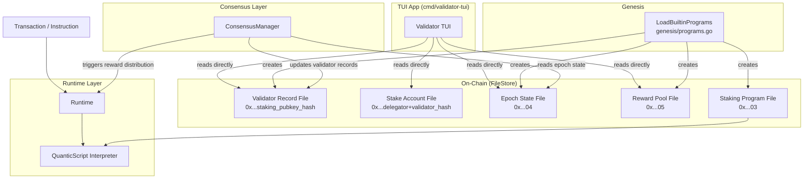

# Design Document — Delegated Proof of Stake (DPoS)

## Overview

This document describes the design for adding Delegated Proof of Stake (DPoS) consensus to the PoH Blockchain. The feature introduces:

1. A **Staking Program** — a QuanticScript smart contract compiled to bytecode, loaded at the well-known `StakingProgramID` (`0x...03`), that handles validator registration, stake delegation, reward distribution, and slashing.
2. **ConsensusManager extensions** — stake-weighted validator scheduling, epoch boundary processing, and missed-block tracking.
3. **Genesis bootstrap** — epoch 0 initialization from a static genesis validator set, with no prior delegation required.
4. A **Validator TUI App** — a standalone Go binary that reads the FileStore directly and renders a live terminal dashboard.
5. A **DPoS demo script** — `demo-dpos.sh`, an automated end-to-end lifecycle script compatible with the existing `analyze-results.sh` tooling.

The design follows the same patterns established by the System Program and Token Program: QuanticScript source at `programs/staking/staking.qs`, compiled to `.qsa` and `.qsb`, loaded via `internal/genesis/programs.go`, and executed through the existing `Runtime` bytecode interpreter.

---

## Architecture



### Key Design Decisions

**Decision 1 — Staking Program as QuanticScript, not native Go.**
Requirement 6 mandates the Staking Program be a QuanticScript contract. This keeps all on-chain logic auditable, upgradeable, and executed through the same interpreter path as all other programs. The tradeoff is that complex operations (e.g., iterating all Stake Accounts for reward distribution) require the QuanticScript interpreter to support file enumeration builtins. We accept this and extend the stdlib as needed rather than adding a native Go bypass.

**Decision 2 — Epoch boundary processing triggered by ConsensusManager, not a cron.**
The ConsensusManager already owns slot timing. It will detect epoch boundaries (slot % epochLength == 0) and submit a synthetic `DistributeRewards` instruction to the Staking Program via the Runtime. This keeps epoch logic on-chain and testable.

**Decision 3 — Separate staked amount and rent reserve in file data payload.**
Requirement 10 explicitly prohibits using the File's top-level `Balance` field to represent staked tokens. The `Balance` field is set to exactly `CalculateStorageCost(dataSize)` at creation time. All staked amounts live in the file's `Data` payload. This prevents storage cost deductions from silently consuming staked funds.

**Decision 4 — Validator Schedule stored in Epoch State File.**
The schedule is a deterministic, stake-weighted assignment computed at each epoch boundary and persisted in the Epoch State File. The seed is the last block hash of the previous epoch, ensuring determinism across restarts.

**Decision 5 — TUI reads FileStore directly (no RPC).**
The TUI is a read-only monitoring tool. Reading BadgerDB directly (with the `--state` flag) avoids the need for an RPC layer and keeps the TUI dependency-light. The FileStore's `GetAllFileIDs` + prefix-based file type detection is sufficient.

---

## Components and Interfaces

### 1. Staking Program (`programs/staking/staking.qs`)

A QuanticScript contract following the same structure as `programs/system/system.qs`.

**Instruction dispatch (entry byte → handler):**

| Byte | Instruction          | Handler                    |
|------|----------------------|----------------------------|
| 0    | RegisterValidator    | `handleRegisterValidator`  |
| 1    | DeregisterValidator  | `handleDeregisterValidator`|
| 2    | DelegateStake        | `handleDelegateStake`      |
| 3    | UndelegateStake      | `handleUndelegateStake`    |
| 4    | WithdrawStake        | `handleWithdrawStake`      |
| 5    | DistributeRewards    | `handleDistributeRewards`  |
| 6    | ReportDoubleSign     | `handleReportDoubleSign`   |

**Error codes (staking-specific, range `0x3000–0x3FFF`):**

```
ERROR_INVALID_INSTRUCTION     = 0x3FFF
ERROR_ALREADY_REGISTERED      = 0x3001
ERROR_NOT_REGISTERED          = 0x3002
ERROR_INVALID_COMMISSION      = 0x3003
ERROR_INSUFFICIENT_BALANCE    = 0x3004
ERROR_VALIDATOR_INACTIVE      = 0x3005
ERROR_COOLDOWN_ACTIVE         = 0x3006
ERROR_INSUFFICIENT_RENT       = 0x3007
ERROR_ZERO_VALIDATORS         = 0x3008
ERROR_INVALID_DOUBLE_SIGN     = 0x3009
```

### 2. Go Serialization Helpers (`internal/quanticscript/stdlib_staking.go`)

New file alongside `stdlib_programs.go` providing Go-side serialization/deserialization for:
- `ValidatorRecord` — pubkey (32), commission (8), totalStake (8), status (1), blocksProduced (8), missedBlocks (8), slashedThisEpoch (1)
- `StakeAccount` — delegatorPubkey (32), validatorFileID (32), stakedAmount (8), activationEpoch (8), status (1), deactivationEpoch (8)
- `EpochState` — epochNumber (8), epochStartSlot (8), validatorSchedule (variable), missedBlockCounters (variable)
- `RewardPool` — balance (8)

These helpers are used by Go-side tests and the genesis bootstrap, not by the QuanticScript contract itself (which uses raw `slice`/`bytesToI64LE` operations).

### 3. ConsensusManager Extensions (`internal/consensus/consensus_manager.go`)

New fields and methods added to `ConsensusManager`:

```go
type ConsensusManager struct {
    // existing fields ...
    epochLength       int64              // default 432000 slots
    genesisValidators []GenesisValidator // from config
    fileStore         *filestore.FileStore
    runtime           *runtime.Runtime
    currentEpoch      int64
    validatorSchedule []filestore.FileID // slot → validator FileID
}

type GenesisValidator struct {
    PublicKey   [32]byte
    StakeAmount int64
}

// New methods:
func (cm *ConsensusManager) GetCurrentEpoch() int64
func (cm *ConsensusManager) IsEpochBoundary(slot int64) bool
func (cm *ConsensusManager) ProcessEpochBoundary(slot int64) error
func (cm *ConsensusManager) GetScheduledValidator(slot int64) filestore.FileID
func (cm *ConsensusManager) RecordMissedBlock(slot int64, validatorID filestore.FileID) error
func (cm *ConsensusManager) InitializeGenesis(config GenesisConfig) error
```

### 4. Genesis Bootstrap Extensions (`internal/genesis/programs.go`)

`LoadBuiltinPrograms` extended to accept staking bytecode and a `GenesisConfig`:

```go
func LoadBuiltinPrograms(fs *filestore.FileStore, systemBytecode, tokenBytecode, stakingBytecode []byte) error

func InitializeDPoSGenesis(fs *filestore.FileStore, config GenesisConfig) error
```

`InitializeDPoSGenesis` creates:
- Staking Program File at `StakingProgramID` (`0x...03`)
- Epoch State File at `EpochStateFileID` (`0x...04`)
- Reward Pool File at `RewardPoolFileID` (`0x...05`)
- One Validator Record File per genesis validator

Well-known IDs:
```go
StakingProgramID = FileID{..., 3}
EpochStateFileID = FileID{..., 4}
RewardPoolFileID = FileID{..., 5}
```

### 5. Validator TUI App (`cmd/validator-tui/main.go`)

Standalone Go binary. Uses `internal/filestore` directly (read-only BadgerDB open). Renders with the `github.com/charmbracelet/bubbletea` or plain `termbox-go` library — whichever is already in `go.mod`. If neither is present, use ANSI escape codes with a simple refresh loop (no external dependency).

**Panels:**
- Header: epoch, slot, local validator status, active validator count, local delegated stake
- Validator table: pubkey (16 hex), status, total stake, commission %, blocks produced, with `[inactive]`/`[slashed]` prefixes
- Summary footer: total staked electrons, Reward Pool balance, estimated APY

Refresh interval: 1000 ms. Exit on `q` or `Ctrl+C`.

### 6. Demo Script (`demo-dpos.sh`)

Bash script accepting `<num_validators> <duration_seconds>`. Produces:
- `logs/dpos-demo-<timestamp>.json` — structured JSON log
- stdout summary table

Lifecycle phases: genesis start → block production → delegation → epoch boundary → reward distribution → double-sign report → slashing verification.

Exit code 0 on full success, non-zero on any phase failure. Log format compatible with `analyze-results.sh`.

---

## Data Models

### ValidatorRecord (stored in File.Data)

```
Offset  Size  Field
0       32    pubkey (Ed25519 public key)
32      8     commission (i64 LE, 0–100)
40      8     totalDelegatedStake (i64 LE, electrons)
48      1     status (0=inactive, 1=active, 2=deregistered)
49      8     blocksProducedThisEpoch (i64 LE)
57      8     missedBlocksThisEpoch (i64 LE)
65      1     slashedThisEpoch (0=false, 1=true)
--- Total: 66 bytes ---
```

File.Balance = `CalculateStorageCost(66)` (rent reserve only).
File.ID = `SHA-256("validator:" || pubkey)`.
File.TxManager = `StakingProgramID`.

### StakeAccount (stored in File.Data)

```
Offset  Size  Field
0       32    delegatorPubkey (Ed25519 public key)
32      32    validatorFileID (FileID of target Validator Record)
64      8     stakedAmount (i64 LE, electrons)
72      8     activationEpoch (i64 LE)
80      1     status (0=active, 1=deactivating, 2=withdrawn)
81      8     deactivationEpoch (i64 LE, 0 if not deactivating)
--- Total: 89 bytes ---
```

File.Balance = `CalculateStorageCost(89)` (rent reserve only).
File.ID = `SHA-256("stake:" || delegatorPubkey || validatorFileID)`.
File.TxManager = `StakingProgramID`.

### EpochState (stored in File.Data)

```
Offset  Size  Field
0       8     epochNumber (i64 LE)
8       8     epochStartSlot (i64 LE)
16      8     totalSlotsInEpoch (i64 LE)
24      8     validatorCount (i64 LE)
32      N*32  validatorSchedule (N FileIDs, one per slot, N = totalSlotsInEpoch)
32+N*32 8     missedBlockCount (i64 LE, per-validator, follows schedule)
```

For genesis (432,000 slots), the schedule section is 432,000 × 32 = ~13.8 MB. This is large; for the initial implementation the schedule will be stored as a compact weighted list (validator FileID + slot count) rather than a full per-slot array, and expanded in memory by the ConsensusManager.

**Compact schedule format:**
```
Offset  Size  Field
0       8     epochNumber (i64 LE)
8       8     epochStartSlot (i64 LE)
16      8     validatorCount (i64 LE, V)
24      V*40  entries: [validatorFileID(32) | assignedSlots(8)]
```

File.ID = `EpochStateFileID` (`0x...04`).
File.TxManager = `StakingProgramID`.

### RewardPool (stored in File.Data)

```
Offset  Size  Field
0       8     balance (i64 LE, electrons)
8       8     lastDistributedEpoch (i64 LE)
--- Total: 16 bytes ---
```

File.ID = `RewardPoolFileID` (`0x...05`).
File.TxManager = `StakingProgramID`.

---

## Error Handling

### Staking Program (QuanticScript)

All handlers return `i64` error codes. The `entry()` function propagates handler return values directly. The Runtime treats any non-zero return as a program error and rolls back the transaction (existing behavior via `tx_processor.go`).

| Scenario | Error Code |
|---|---|
| Unknown instruction byte | `ERROR_INVALID_INSTRUCTION (0x3FFF)` |
| Commission out of 0–100 range | `ERROR_INVALID_COMMISSION (0x3003)` |
| Validator already registered | `ERROR_ALREADY_REGISTERED (0x3001)` |
| Validator not found | `ERROR_NOT_REGISTERED (0x3002)` |
| Delegator balance insufficient | `ERROR_INSUFFICIENT_BALANCE (0x3004)` |
| Target validator deregistered | `ERROR_VALIDATOR_INACTIVE (0x3005)` |
| Cooldown period not elapsed | `ERROR_COOLDOWN_ACTIVE (0x3006)` |
| File balance below storage cost | `ERROR_INSUFFICIENT_RENT (0x3007)` |
| Double-sign proof invalid | `ERROR_INVALID_DOUBLE_SIGN (0x3009)` |

### ConsensusManager

- Epoch boundary processing errors are logged and the node continues (non-fatal). The missed-block counter is incremented for the affected slot.
- If the Epoch State File is missing or corrupted on startup, the ConsensusManager logs a warning and re-initializes from slot 0 (Requirement 9.3).
- If genesis config specifies zero validators, startup returns a fatal error (Requirement 9.6).

### TUI App

- FileStore open errors print to stderr and exit with code 1.
- Missing or unrecognized file types are silently skipped during table rendering.
- BadgerDB is opened in read-only mode to prevent accidental writes.

---

## Testing Strategy

### Unit Tests

- `internal/quanticscript/stdlib_staking_test.go` — serialization round-trips for ValidatorRecord, StakeAccount, EpochState, RewardPool.
- `internal/consensus/consensus_manager_test.go` — epoch boundary detection, schedule computation, missed-block recording.
- `internal/genesis/programs_test.go` — genesis bootstrap creates correct files with correct balances.

### Integration Tests

- `internal/staking_integration_test.go` — full lifecycle: register validator → delegate → epoch boundary → rewards → slash → withdraw. Uses an in-memory FileStore.
- `internal/builtin_programs_integration_test.go` — extended to cover Staking Program instruction dispatch.

### QuanticScript Compiler Tests

- `internal/quanticscript/staking_program_test.go` — compiles `programs/staking/staking.qs` and verifies the bytecode executes each instruction type correctly against a mock ExecutionContext.

### Demo Script

- `demo-dpos.sh` serves as an end-to-end acceptance test. Exit code 0 = all phases passed.
