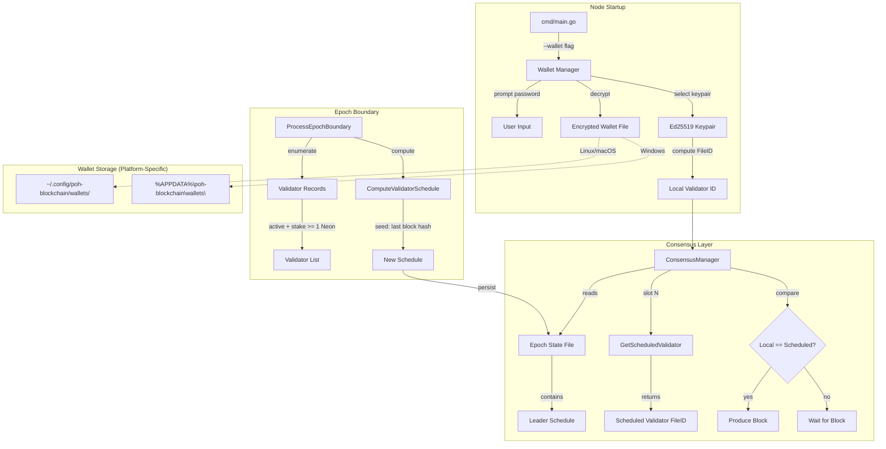

# Design Document — Stake-Weighted Leader Schedule

## Overview

This document describes the design for replacing the static leader/replica node type system with a deterministic stake-weighted leader schedule. The new system:

1. **Removes all static node types** — No more LEADER/REPLICA/OBSERVER enum. Nodes are identified by their validator public key from a password-protected wallet.
2. **Implements stake-weighted leader selection** — Validators are assigned slots proportionally to their delegated stake using a deterministic weighted-random algorithm.
3. **Adds secure wallet management** — Password-protected wallets stored in platform-specific config directories with AES-256-GCM encryption.
4. **Integrates with existing DPoS** — Works seamlessly with the existing Staking Program, Validator Records, and Epoch State Files.
5. **Provides plug-and-play UX** — Wallet selection prompts, automatic validator detection, and clear migration path from old system.

---

## Architecture



---

## Key Design Decisions

### Decision 1 — Wallet-Based Identity Instead of Keypair Files

**Rationale:** Raw JSON keypair files are insecure. Password-protected wallets with strong encryption (AES-256-GCM + Argon2id) provide security without requiring external key management systems. The wallet abstraction also enables future features like multi-sig and hardware wallet support.

**Tradeoff:** Adds complexity to node startup (password prompt, keypair selection). Mitigated by clear UX and automatic validator detection.

### Decision 2 — Platform-Specific Wallet Directory

**Rationale:** Following OS conventions (`~/.config` on Linux/macOS, `%APPDATA%` on Windows) ensures wallets are stored in user-specific, backed-up locations. This is standard practice for CLI tools (e.g., `~/.ssh`, `~/.aws`).

**Implementation:**
```go
func GetWalletDir() (string, error) {
    switch runtime.GOOS {
    case "windows":
        appData := os.Getenv("APPDATA")
        if appData == "" {
            return "", fmt.Errorf("APPDATA environment variable not set")
        }
        return filepath.Join(appData, "poh-blockchain", "wallets"), nil
    default: // linux, darwin
        home, err := os.UserHomeDir()
        if err != nil {
            return "", err
        }
        return filepath.Join(home, ".config", "poh-blockchain", "wallets"), nil
    }
}
```

### Decision 3 — Remove NodeType Enum Entirely

**Rationale:** The `network.NodeType` enum (LEADER, REPLICA, OBSERVER) is fundamentally incompatible with stake-weighted leader rotation. Removing it forces a clean break from the old system and prevents accidental fallback to static leader logic.

**Migration Path:** Nodes using `--type` flags will fail fast with a clear error message and migration instructions.

### Decision 4 — Deterministic Schedule Computation with LCG

**Rationale:** A Linear Congruential Generator (LCG) seeded with the last block hash provides deterministic, reproducible randomness without external dependencies. All nodes compute the same schedule independently.

**Algorithm:**
```
seed = first 8 bytes of last block hash (as uint64)
for each slot in epoch:
    seed = seed * 6364136223846793005 + 1442695040888963407  // LCG step
    randomValue = seed % totalStake
    accumulated = 0
    for each validator:
        accumulated += validator.stake
        if randomValue < accumulated:
            schedule[slot] = validator.fileID
            break
```

**Properties:**
- Deterministic: same inputs → same schedule
- Stake-weighted: validator with 2x stake gets ~2x slots
- Unpredictable: seed changes every epoch (last block hash)

### Decision 5 — In-Memory Schedule Expansion

**Rationale:** Storing 432,000 × 32 bytes (~13.8 MB) per epoch in the Epoch State File is acceptable for in-memory expansion but wasteful for disk storage. The design uses a compact format on disk (validator FileID + slot count) and expands to a full slot-indexed array in memory.

**Compact Format (on disk):**
```
epochNumber (8 bytes)
epochStartSlot (8 bytes)
validatorCount (8 bytes)
for each unique validator:
    validatorFileID (32 bytes)
    assignedSlotCount (8 bytes)
```

**Expanded Format (in memory):**
```
validatorSchedule[slot] = validatorFileID
```

---

## Components and Interfaces

### 1. Wallet Manager (`internal/wallet/wallet.go`)

New package for secure wallet management.

```go
package wallet

type Wallet struct {
    Name     string
    Keypairs []Keypair
}

type Keypair struct {
    PublicKey  [32]byte
    PrivateKey [64]byte
}

// Create a new encrypted wallet
func Create(name string, password string) (*Wallet, error)

// Open an existing wallet with password
func Open(name string, password string) (*Wallet, error)

// List all wallet names in the wallet directory
func List() ([]string, error)

// Export wallet keypairs as unencrypted JSON
func (w *Wallet) Export(outputPath string) error

// Import keypairs from unencrypted JSON
func Import(inputPath string, name string, password string) (*Wallet, error)

// Get wallet file path (platform-specific)
func GetWalletPath(name string) (string, error)

// Encrypt data with AES-256-GCM using Argon2id-derived key
func encrypt(data []byte, password string) ([]byte, error)

// Decrypt data with AES-256-GCM using Argon2id-derived key
func decrypt(data []byte, password string) ([]byte, error)
```

**Wallet File Format (JSON after decryption):**
```json
{
  "version": 1,
  "keypairs": [
    {
      "publicKey": "0x1234...abcd",
      "privateKey": "0x5678...ef01"
    }
  ]
}
```

**Encrypted File Format (binary):**
```
[salt: 32 bytes][nonce: 12 bytes][ciphertext: variable][tag: 16 bytes]
```

### 2. ConsensusManager Refactor (`internal/consensus/consensus_manager.go`)

**Removed Fields:**
```go
nodeType network.NodeType  // REMOVED
```

**New Fields:**
```go
localValidatorID   filestore.FileID  // FileID of local validator (zero if observer)
localValidatorKeys *wallet.Keypair   // Local validator keypair (nil if observer)
```

**Refactored Methods:**

```go
// NewConsensusManager creates a consensus manager with optional validator identity
func NewConsensusManager(localValidatorID filestore.FileID, localKeys *wallet.Keypair) *ConsensusManager

// IsLeader returns true if the local validator is scheduled for this slot
func (cm *ConsensusManager) IsLeader(slot int64) bool {
    if cm.localValidatorID == (filestore.FileID{}) {
        return false // observer mode
    }
    
    scheduledValidator := cm.GetScheduledValidator(slot)
    return scheduledValidator == cm.localValidatorID
}

// GetScheduledValidator returns the validator FileID scheduled for the given slot
func (cm *ConsensusManager) GetScheduledValidator(slot int64) filestore.FileID {
    if len(cm.validatorSchedule) == 0 {
        return filestore.FileID{}
    }
    
    slotInEpoch := slot % cm.epochLength
    if slotInEpoch >= int64(len(cm.validatorSchedule)) {
        return filestore.FileID{}
    }
    
    return cm.validatorSchedule[slotInEpoch]
}

// ProcessEpochBoundary computes new leader schedule and persists to Epoch State File
func (cm *ConsensusManager) ProcessEpochBoundary(slot int64, lastBlockHash [32]byte) error {
    // 1. Enumerate all active Validator Records with stake >= 1 Neon
    validators := cm.enumerateActiveValidators()
    
    // 2. Compute new schedule using last block hash as seed
    newSchedule := cm.ComputeValidatorSchedule(lastBlockHash[:], validators)
    
    // 3. Persist to Epoch State File
    cm.validatorSchedule = newSchedule
    cm.currentEpoch++
    
    return cm.persistEpochState()
}

// enumerateActiveValidators reads all Validator Records from FileStore
func (cm *ConsensusManager) enumerateActiveValidators() []ValidatorEntry {
    // Implementation: iterate FileStore, filter by status=active and stake>=1000000
}

// ComputeValidatorSchedule uses deterministic LCG to assign slots
func (cm *ConsensusManager) ComputeValidatorSchedule(epochSeed []byte, validators []ValidatorEntry) []filestore.FileID {
    // Implementation: LCG-based weighted random selection (see Decision 4)
}
```

### 3. Node Startup Refactor (`cmd/main.go`)

**Removed Flags:**
```go
--type=leader|replica|observer  // REMOVED
```

**New Flags:**
```go
--wallet <wallet_name>          // Wallet name (prompts for password)
--genesis-config <path>         // Genesis validator set (for first node only)
```

**Startup Flow:**

```go
func main() {
    walletName := flag.String("wallet", "", "Wallet name for validator identity")
    genesisConfigPath := flag.String("genesis-config", "", "Genesis configuration file")
    
    flag.Parse()
    
    var localValidatorID filestore.FileID
    var localKeys *wallet.Keypair
    
    if *walletName != "" {
        // Prompt for password
        fmt.Print("Enter wallet password: ")
        password := readPassword()
        
        // Open wallet
        w, err := wallet.Open(*walletName, password)
        if err != nil {
            log.Fatalf("Failed to open wallet: %v", err)
        }
        
        // Select keypair (prompt if multiple)
        selectedKeypair := selectKeypair(w, fileStore)
        localKeys = &selectedKeypair
        
        // Compute validator FileID
        localValidatorID = computeValidatorFileID(selectedKeypair.PublicKey)
        
        log.Printf("Starting node as validator: %s", hex.EncodeToString(localValidatorID[:])[:16])
    } else {
        log.Printf("Starting node in observer mode (no wallet specified)")
    }
    
    // Create ConsensusManager with validator identity
    consensusManager := consensus.NewConsensusManager(localValidatorID, localKeys)
    
    // Initialize genesis if needed
    if *genesisConfigPath != "" {
        genesisConfig := loadGenesisConfig(*genesisConfigPath)
        consensusManager.InitializeGenesis(genesisConfig)
    }
    
    // Start node...
}

func selectKeypair(w *wallet.Wallet, fs *filestore.FileStore) wallet.Keypair {
    if len(w.Keypairs) == 1 {
        return w.Keypairs[0]
    }
    
    // Display keypairs with validator status
    fmt.Println("Select a keypair:")
    for i, kp := range w.Keypairs {
        pubkeyHex := hex.EncodeToString(kp.PublicKey[:])[:16]
        validatorID := computeValidatorFileID(kp.PublicKey)
        
        // Check if validator is registered
        validatorFile, err := fs.GetFile(validatorID)
        status := "not registered"
        if err == nil && validatorFile != nil {
            _, _, _, statusByte, _, _, _, _ := quanticscript.DeserializeValidatorRecord(validatorFile.Data)
            if statusByte == 1 {
                status = "active validator"
            } else {
                status = "inactive validator"
            }
        }
        
        fmt.Printf("  %d. %s... (%s)\n", i+1, pubkeyHex, status)
    }
    
    // Read user selection
    var selection int
    fmt.Scanf("%d", &selection)
    
    return w.Keypairs[selection-1]
}
```

### 4. Wallet CLI Commands (`cmd/main.go` subcommands)

```go
// wallet create --name <name>
func walletCreateCmd() {
    name := flag.String("name", "", "Wallet name")
    flag.Parse()
    
    password := promptPassword("Enter password: ")
    confirmPassword := promptPassword("Confirm password: ")
    
    if password != confirmPassword {
        log.Fatal("Passwords do not match")
    }
    
    w, err := wallet.Create(*name, password)
    if err != nil {
        log.Fatalf("Failed to create wallet: %v", err)
    }
    
    fmt.Printf("Wallet created: %s\n", *name)
    fmt.Printf("Public key: %s\n", hex.EncodeToString(w.Keypairs[0].PublicKey[:]))
}

// wallet list
func walletListCmd() {
    wallets, err := wallet.List()
    if err != nil {
        log.Fatalf("Failed to list wallets: %v", err)
    }
    
    fmt.Println("Available wallets:")
    for _, name := range wallets {
        fmt.Printf("  - %s\n", name)
    }
}

// wallet show --name <name>
func walletShowCmd() {
    name := flag.String("name", "", "Wallet name")
    flag.Parse()
    
    password := promptPassword("Enter password: ")
    
    w, err := wallet.Open(*name, password)
    if err != nil {
        log.Fatalf("Failed to open wallet: %v", err)
    }
    
    fmt.Printf("Wallet: %s\n", *name)
    fmt.Println("Keypairs:")
    for i, kp := range w.Keypairs {
        fmt.Printf("  %d. %s\n", i+1, hex.EncodeToString(kp.PublicKey[:])[:16])
    }
}

// wallet export --name <name> --output <file>
func walletExportCmd() {
    // Implementation: decrypt wallet, write unencrypted JSON
}

// wallet import --input <file> --name <name>
func walletImportCmd() {
    // Implementation: read unencrypted JSON, encrypt with new password
}
```

### 5. Network Node Refactor (`internal/network/network_node.go`)

**Removed:**
```go
type NodeType int
const (
    LEADER NodeType = iota
    REPLICA
    OBSERVER
)
```

**No replacement needed.** Node identity is now determined by the validator FileID in ConsensusManager.

---

## Data Models

### Wallet File (Encrypted)

**Binary Format:**
```
Offset  Size  Field
0       32    salt (random, for Argon2id)
32      12    nonce (random, for AES-GCM)
44      N     ciphertext (encrypted JSON)
44+N    16    authentication tag (AES-GCM)
```

**Decrypted JSON:**
```json
{
  "version": 1,
  "keypairs": [
    {
      "publicKey": "hex string (64 chars)",
      "privateKey": "hex string (128 chars)"
    }
  ]
}
```

### Genesis Configuration File

**JSON Format:**
```json
{
  "epochLength": 432000,
  "validators": [
    {
      "publicKey": "0x1234...abcd",
      "stake": 10000000
    },
    {
      "publicKey": "0x5678...ef01",
      "stake": 5000000
    }
  ]
}
```

### Epoch State File (Compact Format)

**Binary Format:**
```
Offset  Size  Field
0       8     epochNumber (i64 LE)
8       8     epochStartSlot (i64 LE)
16      8     totalSlotsInEpoch (i64 LE)
24      8     uniqueValidatorCount (i64 LE, V)
32      V*40  entries: [validatorFileID(32) | assignedSlots(8)]
```

**In-Memory Expansion:**
```go
func expandSchedule(compactSchedule []ScheduleEntry) []filestore.FileID {
    fullSchedule := make([]filestore.FileID, totalSlotsInEpoch)
    slotIndex := 0
    
    for _, entry := range compactSchedule {
        for i := int64(0); i < entry.AssignedSlots; i++ {
            fullSchedule[slotIndex] = entry.ValidatorFileID
            slotIndex++
        }
    }
    
    return fullSchedule
}
```

---

## Error Handling

### Wallet Errors

| Scenario | Error Message |
|---|---|
| Wallet not found | `Wallet '<name>' not found in <wallet_dir>` |
| Incorrect password | `Incorrect password for wallet '<name>'` |
| Wallet already exists | `Wallet '<name>' already exists` |
| Corrupted wallet file | `Wallet file corrupted or invalid format` |

### Consensus Errors

| Scenario | Behavior |
|---|---|
| No active validators at epoch boundary | Log error, continue with previous schedule |
| Epoch State File corrupted | Log warning, re-initialize from genesis |
| Scheduled validator not found | Skip slot, record missed block |

### Migration Errors

| Old Flag | Error Message |
|---|---|
| `--type=leader` | `Error: --type flag is deprecated. Use --wallet <name> instead. Create a wallet with: poh-blockchain wallet create --name <name>` |
| `--type=replica` | `Error: --type flag is deprecated. Use --wallet <name> for validation, or omit for observer mode.` |

---

## Testing Strategy

### Unit Tests

- `internal/wallet/wallet_test.go` — encryption/decryption round-trips, password validation, platform-specific paths
- `internal/consensus/consensus_manager_test.go` — schedule computation determinism, IsLeader logic, epoch boundary processing

### Integration Tests

- `internal/stake_weighted_consensus_test.go` — full lifecycle: genesis → block production → epoch boundary → schedule recalculation
- Test with 2, 3, and 5 validators with different stake weights
- Verify stake-weighted slot distribution (validator with 2x stake gets ~2x slots)

### Migration Tests

- `internal/migration_test.go` — verify old `--type` flags are rejected with correct error messages

### Demo Script

- Update `demo-dpos.sh` to use `--wallet` flags instead of `--type` flags
- Create genesis wallets automatically
- Display validator selection prompts in non-interactive mode (use `--wallet-keypair-index` flag for automation)

---

## Migration Plan

### Phase 1: Add Wallet System (Non-Breaking)

1. Implement `internal/wallet` package
2. Add wallet CLI commands
3. Keep existing `--type` flag functional (deprecated warning)

### Phase 2: Refactor ConsensusManager (Breaking)

1. Remove `nodeType` field, add `localValidatorID`
2. Implement stake-weighted `IsLeader` logic
3. Update all tests to use new constructor

### Phase 3: Remove Old System (Breaking)

1. Remove `--type` flag, add rejection error
2. Remove `network.NodeType` enum
3. Update all demo scripts and documentation

### Phase 4: Validation

1. Run full integration test suite
2. Run demo script with 5 validators
3. Verify stake-weighted slot distribution
4. Verify epoch boundary schedule recalculation
